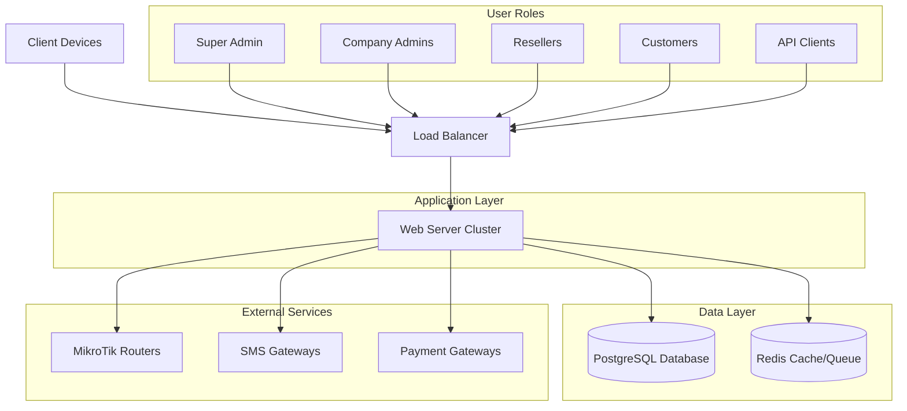

# ISP Billing & CRM System Architecture

## High-Level Architecture

## System Components

### 1. Frontend Layer
- Vue 3 + Tailwind CSS responsive web application
- Separate interfaces for:
  - Super Admin portal
  - Company Admin panels
  - Reseller panels
  - Customer portal
  - Mobile-responsive design

### 2. Backend Layer (Laravel PHP 8.x)
- Multi-tenant architecture with domain-based company panels
- RESTful API for web and mobile clients
- Authentication system (Laravel Sanctum/Passport)
- Role-based access control (spatie/laravel-permission)
- Queue processing (Redis + Laravel Queue)
- PDF generation (barryvdh/laravel-dompdf)
- Excel/CSV processing (maatwebsite/excel)

### 3. Database Layer (PostgreSQL)
- Shared database with company_id scoping for multi-tenancy
- Logical data isolation between companies
- Support for schema-based tenant separation (optional)

### 4. Integration Layer
- MikroTik RouterOS API integration for PPPoE management
- SMS gateway integrations (HTTP GET/POST/JSON)
- Payment gateway integrations (bKash/Nagad/Rocket)
- Real-time notifications (Laravel Echo + Pusher/Socket.io)

### 5. Infrastructure Layer
- Docker containerization (Nginx + Supervisor)
- Redis for caching and queue processing
- PostgreSQL for primary data storage